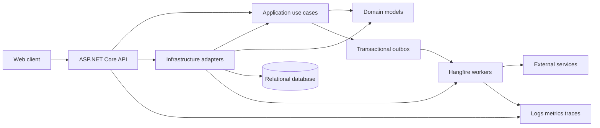

# Architecture overview

Jersey OS starts as a modular monolith: one deployable application, one relational database, and independently owned business modules. Clean Architecture dependency rules keep domain policy isolated while allowing later extraction where operational evidence warrants it.

## Layer responsibilities

- **Domain:** entities, value objects, invariants, domain events; no framework or persistence dependencies.
- **Application:** commands, queries, policies, ports, transaction orchestration; depends on Domain.
- **Infrastructure:** persistence, Identity, messaging, jobs, external integrations; implements Application ports.
- **API:** HTTP composition, authentication, validation mapping, versioned contracts; invokes Application use cases.
- **Web:** generated API client and user experience; no duplicated server policy.

## Runtime rules

- Requests establish correlation, authenticated actor, and organization context before application logic.
- Writes commit domain state and outbox messages atomically.
- Workers claim outbox messages and jobs with retry-safe, idempotent handlers.
- Module data is private. Cross-module reads use published application contracts, not table joins.

See [ADRs](adr/README.md), [module boundaries](module-boundaries.md), and the [security model](security.md).
