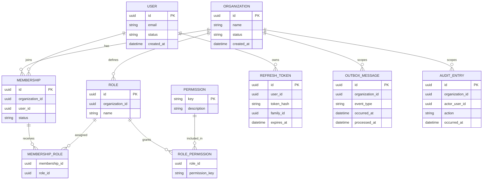
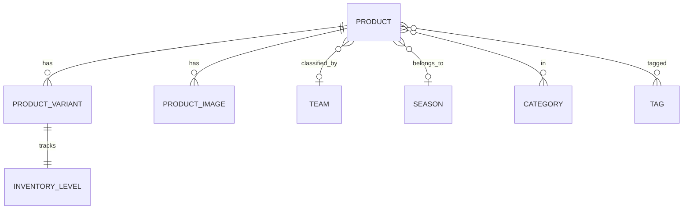
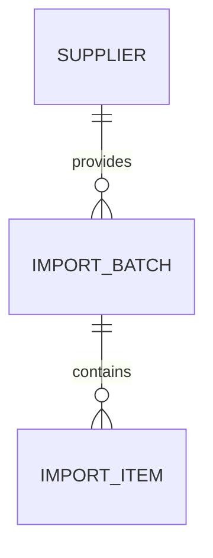
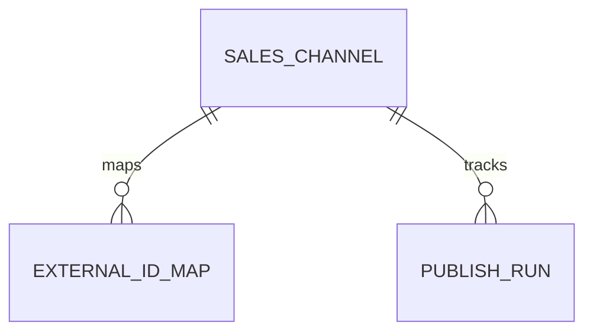

# Database conventions

Use a supported relational database with EF Core migrations. Each module owns a schema or consistently prefixed tables and its migration history.

## Conventions

- Tables and columns use `snake_case`; application types use idiomatic .NET naming.
- Primary keys are non-meaningful UUIDs generated application-side.
- Store timestamps as UTC `timestamp with time zone`; suffix names with `_at`.
- Organization-owned rows require non-null `organization_id` and an indexed foreign key.
- Concurrency-sensitive aggregates use an optimistic concurrency token.
- Foreign keys are enforced inside a module. Cross-module references store IDs without cross-schema foreign keys.
- Money uses decimal amount plus ISO 4217 currency; never floating point.
- Soft deletion is exceptional; prefer explicit lifecycle state and immutable audit records.
- Schema changes are forward-compatible, reviewed migrations. Use expand/migrate/contract for breaking changes.
- Never place secrets or raw refresh tokens in the database; store one-way token hashes.

## Foundation model

The diagram is a conceptual foundation, not a substitute for migrations. Identity provider tables may use provider-required shapes while preserving these ownership and security rules.

## Catalog model

Tables are prefixed `catalog_` and organization-filtered.

Unique constraints include `(organization_id, slug)` on products and taxonomy, and `(organization_id, sku)` on variants. Inventory concurrency uses a SQL Server `rowversion` token.

## Import model

Tables are prefixed `import_` and organization-filtered.

Batches track parse/review lifecycle; items store proposed fields, match hints, and applied product/variant links after approve.

## Publishing model

Tables are prefixed `publish_` and organization-filtered.

`ExternalIdMap` keys on `(organization_id, channel_id, entity_type, local_id)`. `PublishRun` tracks the latest attempt per product/channel (`Pending` | `Succeeded` | `Failed`).
